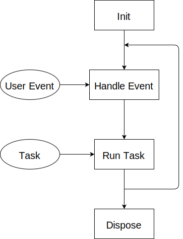
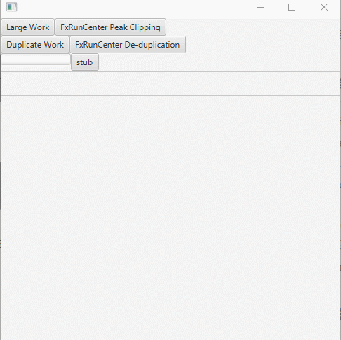
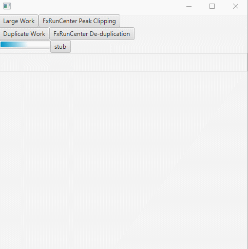
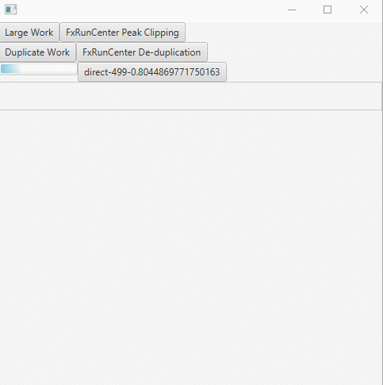

一般UI框架都是单线程事件模型。一个典型的UI线程如图



在UI初始化后，除了不断地处理用户事件以外。还会维护一个事件队列以接收其他线程调度来的任务。UI框架会提供接口以调度任务回UI线程。例如

- JavaFx -> `Platform.runLater`
- Swing -> `SwingUtilities.invokeLater`
- SWT -> `Display.asyncExec`

一般对于耗时操作，我们会先在任务线程里运行，得到结果后调度回到UI线程进行更新。

但是对于一些特定业务，即使调度得到也仍会造成UI卡顿。例如：

1. 一些较耗时任务必须要在UI线程执行，这些任务一旦累计在一个UI循环里，这就会造成UI线程阻塞。
2. 一些任务其实是重复的，后续任务会覆盖前者的结果，但是所有任务都被执行了。这种情况即使不造成UI阻塞， 也会感受到明显卡顿。

针对以上两种情况，我们对UI事件线程进行优化。通过自定义的调度器来取代原生调度器，从而使UI更加顺滑。
我们先来看看解决问题的效果，然后解析实现原理。

# 削峰

第一种情况的问题其实是大量任务被调度到UI线程中，UI线程阻塞在`Run Task`阶段，就造成了无法响应`Handle Event`了。

这里我们模拟业务是在UI上添加500个按钮，每个按钮都包含一个小型的10ms任务。

```java
// javafx
for (int i = 0; i < 500; i++) {
    Thread.sleep(10);
    flowPane.getChildren().add(new Button("direct-" + i));
}
```

效果如下



可以看到，UI阻塞了5秒，然后一次性刷新了所有组件。

接着让我们来看看优化后，使用我们的`FxRunCenter`来调度任务：

```java
for (int i = 0; i < 500; i++) {
    int index = i;
    FxRunCenter.runLater(() -> { // use FxRunCenter
        Thread.sleep(10);
        flowPane.getChildren().add(new Button("center-" + index));
    });
}
```

效果如下


可以看到，UI没有被阻塞，所有任务即时地反应到了UI上。

# 去重

对于第二种情况，先触发地工作并不知道后面会有任务覆盖它，轮到后面的任务执行时，已无力回天。最后的结果就是所有重复的工作都被执行到了。

这里我们模拟的业务是设置`Button`的文字，重复500次，但是事实上只有最后一次才是有效的。

```java
for (int i = 0; i < 500; i++) {
    Thread.sleep(10);
    stubButton.setText("direct-" + i + "-" + Math.random());
}
```

效果如下



可以看到，UI被阻塞了5s，然后显示了最后一次任务的结果。

同样的，我们用`FxRunCenter`来优化我们的操作：

```java
for (int i = 0; i < 500; i++) {
    int index = i;
    FxRunCenter.builder().id(stubButton).run(() -> {
        Thread.sleep(10);
        stubButton.setText("center-" + index + "-" + Math.random());
    });
}
```

效果如下



可以看到，UI再次回归丝滑。

# 思路+源码解析

**_本文以JavaFX实现为例，但是大部分UI框架原理上都是一样的，可以自行仿照_

- 对于削峰问题，我们要做的其实就是把突然涌入的大量任务存起来，然后均匀的铺在UI线程里。
- 对于去重问题，我们可以把任务暂时放一放到下一个UI循环，这样如果有重复任务到来，我们就可以把先前的任务丢弃。

核心源码：

```java
// 任务队列，存储准备调度到UI的任务
final Deque<Runnable> tasks = new LinkedBlockingDeque<>();
// 优先任务队列，其中的元素将会插入到任务队列头
final Deque<Runnable> advTasks = new LinkedBlockingDeque<>();
// 任务标识，<ID, Task>，同一个ID只有要给对应的任务
final Map<Object, Runnable> taskMap = new ConcurrentHashMap<>();
// 调度器自己(this::run)是否调度到了UI线程中
final AtomicBoolean scheduled = new AtomicBoolean(false);
// 是否正在调度任务队列里的任务
boolean running;

// 调度任务(无ID)
void schedule(Runnable r) {
    schedule(null, r);
}

// 绑定一个ID来调度任务
void schedule(Object id, Runnable r) {
    Objects.requireNonNull(r, "Task can't be null");
    if (id != null) {
        // 包装原任务，在任务结束时从Map中删除自己
        Runnable origin = r;
        r = new Runnable() {
            @Override
            public void run() {
                origin.run();
                taskMap.remove(id, this);
            }
        };
        // 如果存在同ID的任务，从队列中删除旧任务
        Runnable old = taskMap.put(id, r);
        if (old != null) {
            tasks.remove(old);
            advTasks.remove(old);
            // WaitRunnable用于支持异步阻塞操作，详见源码
            if (old instanceof WaitRunnable) {
                ((WaitRunnable) old).done();
            }
        }
    }
    // 如果任务来自于调度器执行的任务，则将任务置入优先队列，否则直接置入任务队列
    if (Platform.isFxApplicationThread() && running) {
        advTasks.addFirst(r);
    } else {
        tasks.addLast(r);
    }
    // 确保自己已经调度到了UI线程
    scheduleThis();
}

void scheduleThis() {
    // 如果还没有调度自己，则把自己调度到UI线程
    if (scheduled.compareAndSet(false, true)) {
        Platform.runLater(this::run);
    }
}

void run() {
    // 开始计时
    Stopwatch sw = Stopwatch.createStarted();
    running = true;
    while (!tasks.isEmpty()) {
        // 从队列头去除任务执行
        Runnable r = tasks.pollFirst();
        r.run();
        // 将子任务从优先队列放回到任务队列
        advTasks.forEach(tasks::addFirst);
        advTasks.clear();
        // 如果执行事件已经超过设定一帧的阈值，则不再执行新的任务
        // FRAME_MILLIS可以自行配置
        if (sw.elapsed(TimeUnit.MILLISECONDS) > FRAME_MILLIS) {
            break;
        }
    }
    running = false;
    // 重新调度自己到下一个UI循环
    if (scheduled.compareAndSet(true, false)) {
        if (!tasks.isEmpty()) {
            scheduleThis();
        }
    }
}
```